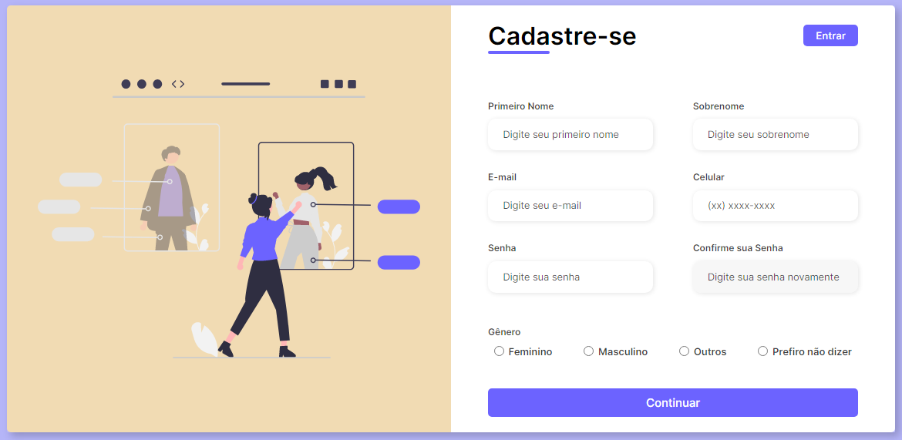

<h1 align="center"> Responsive registration form </h1>

  <a href="#-tecnologias">Tecnologias</a>&nbsp;&nbsp;&nbsp;|&nbsp;&nbsp;&nbsp;
  <a href="#-projeto">Projeto</a>&nbsp;&nbsp;&nbsp;|&nbsp;&nbsp;&nbsp;
  <a href="#-layout">Layout</a>&nbsp;&nbsp;&nbsp;|&nbsp;&nbsp;&nbsp;
  <a href="#memo-licença">Licença</a>

  

 

  

## 🚀 Tecnologias

Esse projeto foi desenvolvido com as seguintes tecnologias:

- HTML e CSS
- Git e Github

## 💻 Projeto

Este projeto é um formulário de registro.

## 🔖 Layout

Você pode visualizar o canal que foi utilizado como aula [NESTE LINK](https://www.youtube.com/watch?v=zWw0npNDkVM&list=LL&index=1&ab_channel=LarissaKich).
## :memo: Licença

Esse projeto está sob a licença MIT.

---

Feito com ♥ by Arthur Oliveira
